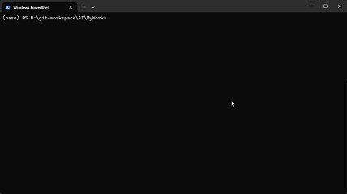

# Agent Switch Skill

> A Codex-ready skill and bundled CLI for switching coding agents, capturing model conversations, and returning clean handoff summaries.

<div align="center">

  

**Author**: [ASunYC](https://github.com/ASunYC)



</div>

---

## Overview

Agent Switch Skill packages the `agent-switch` command as an installable agent skill. It lets Codex, Claude Code, CodeWhale, OpenCode, and other coding agents delegate work to another CLI while recording the model API traffic that passes through the local capture proxy.

It helps you:

- Install a ready-to-use `agent-switch` CLI from the skill directory
- Start another coding CLI with one command, such as `agent-switch claude`
- Capture prompts, tool calls, responses, status codes, and request metadata
- Open a local dashboard with modular segments over captured agent conversations
- See live session-wide totals: request count, status rate, tokens (in/out/cache), cost, and compact savings
- Export captured requests as Markdown, raw HTTP, JSON, or HAR
- Return a concise handoff summary back to the current Codex session
- Run proxy-only mode for IDEs or custom OpenAI/Anthropic-compatible clients
- Isolate multiple local CLI accounts with named profiles
- Remember local Hermes API authorization after asking the user once

## Design Goals

Agent Switch Skill is designed to be simple for agents to bootstrap automatically:

- Node.js 18+ runtime
- Skill-first installation flow for Codex
- Bundled CLI package under `cli/`
- One-command agent switching
- Local-only capture storage
- Provider recipes for common coding CLIs and model gateways
- Clear handoff output after delegated work finishes

## Agent Skill Flow

When a user says "use agent-switch-skill" or asks Codex to switch agents, Codex should first verify that the CLI is installed:

```bash
agent-switch --help
```

If the command is missing, run the bundled installer from this skill directory:

```bash
node scripts/install-agent-switch.js
```

The installer installs the bundled CLI package from `cli/`, verifies `agent-switch --help`, and prints diagnostic output if installation or PATH verification fails.

## Features

### Core Capabilities

- **Agent handoff**: run another coding CLI and return to Codex when it exits
- **Conversation capture**: inspect model-facing requests and responses
- **Dashboard with segments**: browse saved logs in a local web UI with configurable info segments
- **Session-wide stats**: live totals for tokens (input/output/cache), cost, status rate, and compact savings
- **Exports**: write captured requests as `raw`, `md`, `json`, or `har`
- **Provider wrappers**: support Claude Code, Codex, CodeWhale, DeepSeek-TUI legacy shims, Kimi, OpenCode, and compatible gateways
- **CLI profiles**: isolate Claude Code, Codex, and OpenCode accounts/configs under `~/.agent-switch/profiles`
- **Custom commands**: wrap arbitrary CLIs with `agent-switch run --provider <provider> -- <cmd...>`
- **Storage migration**: move legacy project logs into the global store
- **Session cleanup**: delete sessions and reclaim orphaned content blobs

### Technical Highlights

- Skill-bundled source code under `code/`
- No separate package download is required for local development
- Global command installed from the current checkout
- Redacts auth headers by default
- Uses content-addressed storage for captured payloads
- Includes Node test coverage for CLI, providers, parsing, storage, exports, and handoff behavior

## Installation

### Option 1: Ask Codex to Install It

Copy this prompt into Codex:

```text
Please install Agent Switch Skill:

1. Clone the repository:
   git clone https://github.com/ASunYC/agent-switch-skill.git

2. Install it into the Codex skills directory:
   Copy-Item -Recurse agent-switch-skill $env:USERPROFILE/.codex/skills/agent-switch-skill

3. Enter the installed skill directory and install the CLI:
   cd $env:USERPROFILE/.codex/skills/agent-switch-skill
   node scripts/install-agent-switch.js

4. Verify the command:
   agent-switch --help

After installation, tell me how to run `agent-switch claude` and inspect captured conversations.
```

### Option 2: Manual Installation

Clone the repository:

```bash
git clone https://github.com/ASunYC/agent-switch-skill.git
cd agent-switch-skill
```

Install it into your Codex skill directory:

```powershell
# Windows PowerShell
Copy-Item -Recurse . $env:USERPROFILE/.codex/skills/agent-switch-skill
```

```bash
# macOS / Linux
mkdir -p ~/.codex/skills
cp -R . ~/.codex/skills/agent-switch-skill
```

Install the global CLI:

```bash
node scripts/install-agent-switch.js
```

Verify the installation:

```bash
agent-switch --help
```

### Option 3: Build the Bundled CLI Package

Build the npm tarball that ships with the skill and includes runtime dependencies:

```bash
npm run build:package
```

The package is written to `cli/` and can be installed on any machine with Node.js 18 or newer:

```bash
npm install -g cli/agent-switch-skill-0.1.0.tgz
```

This is the release shape used by `scripts/install-agent-switch.js`, so a cloned skill repository can install the CLI without relying on the skill directory to already contain `node_modules`.

## Usage

### Quick Start

```bash
# Pick a CLI from a searchable terminal picker
agent-switch

# Start Claude Code through agent-switch (auto-open the dashboard)
agent-switch claude --open

# Start Claude Code through agent-switch (headless; URL is printed)
agent-switch claude

# Start Codex through agent-switch
agent-switch codex

# Start CodeWhale through agent-switch
agent-switch codewhale

# Start DeepSeek-TUI legacy shim through agent-switch
agent-switch deepseek

# Start Claude Code against Kimi / Moonshot
agent-switch kimi

# Browse saved logs after a capture run (no capture, no CLI launched)
agent-switch dashboard
agent-switch webui
```

### Dashboard During a Capture Run

When you run `agent-switch claude` (or any provider), the dashboard server starts in the background and prints its URL on startup:

```text
  * agent-switch watching Claude Code -> https://api.anthropic.com
    dashboard: http://127.0.0.1:54321
```

You can open that URL in another browser tab at any time while the CLI is running - you do not need to exit the CLI. Use `--open` to auto-open the browser when capture starts, or `--no-open` to keep it headless (the URL is still printed).

Use `agent-switch dashboard` (or the `webui` / `view` aliases) only when you want to browse previously captured sessions without starting a new capture run.

### Run Another CLI

Pass normal CLI arguments after the provider name:

```bash
agent-switch claude --resume
agent-switch codex --model gpt-5
agent-switch codewhale
agent-switch opencode
```

Wrap a custom command:

```bash
agent-switch run --provider openai -- my-openai-compatible-cli
agent-switch run --provider claude -- my-anthropic-compatible-cli
agent-switch run --upstream https://my.api/v1 --env-var MY_BASE_URL -- my-tool
```

Captured CLI runs do not open a browser by default. When the delegated CLI exits, Agent Switch prints a Codex handoff summary with the exit code, session id, captured request count, dashboard command, and latest export command.

Running `agent-switch` without a command opens a searchable terminal picker for supported CLIs. Explicit commands such as `agent-switch codex` still start directly without prompting.

### Multiple CLI Accounts

Profiles isolate a target CLI's account/config directory while keeping the current project directory unchanged.

For Codex, use one command:

```bash
agent-switch profile new codex/work
agent-switch codex --profile work
```

When `--profile` is present, Agent Switch opens a searchable local Codex auth picker:

```text
Select Codex auth

Type to search saved auth
> add auth
  saved Codex auth account
  remove auth
```

Choosing `add auth` starts the normal `codex login` flow in a temporary login directory, then saves the resulting auth into the local account store:

```text
~/.agent-switch/profiles/codex/.accounts/
```

Choosing an existing saved auth injects that account into the requested runtime profile before Codex starts:

```text
~/.agent-switch/profiles/codex/work/auth.json
```

Then Codex launches in the current project directory with:

```text
CODEX_HOME=~/.agent-switch/profiles/codex/work
```

This means `agent-switch codex --profile work` uses the selected Codex account while staying in the current project folder. If the profile already has saved Codex sessions and no extra Codex arguments were supplied, Agent Switch resumes the latest session by default with `resume --last`. If the profile has no sessions yet, it starts a new Codex session.

To choose a session yourself, pass Codex's resume command through:

```bash
agent-switch codex --profile work resume
agent-switch codex --profile work resume --all
agent-switch codex --profile work resume <session-id>
```

`resume` shows Codex's resume picker for the current working directory. `resume --all` shows sessions across directories.

Plain `agent-switch codex` is not changed and continues to use the normal default Codex account/config.

Claude Code and OpenCode profiles remain simple isolated config directories:

```bash
agent-switch profile new claude/work
agent-switch claude --profile work
agent-switch claude --resume

agent-switch profile new opencode/work
agent-switch opencode --profile work
```

Profile directories are stored under:

```text
~/.agent-switch/profiles/<tool>/<name>
```

Shared profiles may link or copy safe files such as `config.toml`, `settings.json`, skills, commands, and plugins. Agent Switch never shares known auth/session files such as Codex `auth.json`, Claude `.credentials.json`, session folders, or history files unless a Codex auth is explicitly selected from the local auth menu.

Treat `~/.agent-switch/profiles/codex/.accounts` as sensitive local data because it stores saved Codex auth snapshots for injection.

### Headroom Compact

Compact mode is off by default. Normal captured runs stay transparent and forward Claude Code requests unchanged.

Enable compact mode explicitly for Claude Code based providers:

```bash
agent-switch claude --compact
agent-switch kimi --compact
agent-switch bedrock --compact
agent-switch vertex --compact
```

Compact mode uses the bundled `headroom-ai` JavaScript SDK against an external Headroom proxy. Install and start Headroom separately:

```bash
pip install "headroom-ai[proxy]"
headroom proxy
agent-switch compact doctor
```

By default, compact mode is fail-open. If Headroom is unavailable, Agent Switch records the failure and forwards the original Claude request:

```bash
agent-switch claude --compact --compact-fail open
```

Use fail-closed only when you prefer stopping the request over sending uncompressed context:

```bash
agent-switch claude --compact --compact-fail closed
```

The dashboard stores and displays both views: the original request captured from Claude Code and the forwarded request sent upstream after compression. RTK is not initialized by compact v1; command-output compression can be evaluated separately later.

### Missing Target CLI

Agent Switch installs the capture command, but it does not silently install third-party coding CLIs. If the delegated CLI is missing, Agent Switch prints targeted install guidance.

For Claude Code, install it first:

```powershell
# Windows
winget install Anthropic.ClaudeCode

# Windows alternative
irm https://claude.ai/install.ps1 | iex
```

```bash
# macOS / Linux
curl -fsSL https://claude.ai/install.sh | bash

# macOS Homebrew
brew install --cask claude-code
```

Then reopen the terminal and verify:

```bash
claude
agent-switch claude
```

For CodeWhale, install the renamed DeepSeek-TUI package:

```bash
npm install -g codewhale
# or
cargo install codewhale-cli --locked
cargo install codewhale-tui --locked
```

Then verify:

```bash
codewhale doctor
agent-switch codewhale
```

### Local Upstream Not Reachable

If `agent-switch claude` says the local upstream is not reachable, Claude Code is pointing at a local router such as CC Switch, but nothing is listening on that port.

For example:

```text
ANTHROPIC_BASE_URL=http://127.0.0.1:15721
```

Start or restart CC Switch, verify the configured port is healthy, and retry:

```bash
agent-switch claude
```

If the router moved to a different port, pass it explicitly:

```bash
agent-switch claude --upstream http://127.0.0.1:<port>
```

### Inspect Conversations

```bash
# Open the dashboard over saved logs
agent-switch dashboard
agent-switch webui

# Export one captured request as Markdown
agent-switch export <session>/<seq> --format md

# Export raw HTTP
agent-switch export <session>/<seq> --format raw

# Export machine-readable data
agent-switch export <session>/<seq> --format json
agent-switch export <session>/<seq> --format har
```

### Dashboard Segments

The dashboard overview bar is built from independent, configurable segments inspired by terminal statuslines like Powerlevel10k / Coralline. Each segment renders one piece of session information and can be turned on or off individually.

The default segments are:

| Segment | Shows |
|---|---|
| 📦 Sessions | Active capture session count and live status |
| 📊 Status | Request success rate with a colored bar and status code breakdown |
| 👤 Profile | The current CLI profile name (e.g. `claude/work`) |
| 🗜 Compact | Headroom compression ratio and cumulative tokens saved |
| 📝 Tokens | Session-wide totals: input, output, cache-read, and combined token count |

Two additional segments are available but off by default:

| Segment | Shows |
|---|---|
| ⏱ Latency | Average and p95 request latency |
| 💰 Cost | Estimated API cost from priced requests |

Click the **⚙ segments** button in the overview bar to open the segment settings modal. There you can:

- Toggle individual segments on or off
- Pick a layout: **Grid** (cards wrap into a responsive grid) or **Bar** (single row)

Your choices are saved to `localStorage` and persist across dashboard sessions. The per-request metrics (model, status, input/output tokens, cost, stop reason, export links) continue to render below the segment bar whenever a single request is selected.

### Manage Stored Logs

```bash
# Copy legacy ./.agent-switch logs from the current project into the global store
agent-switch migrate

# Repack stored captures into the deduped storage format
agent-switch repack

# Repack one session
agent-switch repack <session>

# Delete a session and reclaim orphaned blobs
agent-switch rm <session>
```

## Commands

### Basic Commands

| Command | Example | Description |
|---|---|---|
| `claude` | `agent-switch claude` | Start Claude Code with capture enabled |
| `codex` | `agent-switch codex` | Start Codex with capture enabled |
| `codewhale` | `agent-switch codewhale` | Start CodeWhale with capture enabled |
| `codewhale-tui` | `agent-switch codewhale-tui` | Start the CodeWhale TUI binary directly |
| `deepseek` | `agent-switch deepseek` | Start the DeepSeek-TUI legacy shim with capture enabled |
| `deepseek-tui` | `agent-switch deepseek-tui` | Start the DeepSeek-TUI legacy runtime shim directly |
| `kimi` | `agent-switch kimi` | Start Claude Code against Kimi / Moonshot |
| `opencode` | `agent-switch opencode` | Start OpenCode with capture enabled |
| `run` | `agent-switch run --provider openai -- my-cli` | Wrap an arbitrary compatible CLI |
| `dashboard` | `agent-switch dashboard` | Open the dashboard over saved logs |
| `webui` | `agent-switch webui` | Alias for `dashboard` |
| `view` | `agent-switch view` | Backward-compatible alias for `dashboard` |
| `profile` | `agent-switch profile new claude/work` | Manage isolated CLI account/config profiles |
| `install` | `agent-switch install` | Print local install and update commands |

### Log and Proxy Commands

| Command | Example | Description |
|---|---|---|
| `export` | `agent-switch export <id> --format md` | Export a captured request |
| `migrate` | `agent-switch migrate` | Copy legacy project logs into the global store |
| `repack` | `agent-switch repack <session>` | Repack stored captures |
| `rm` | `agent-switch rm <session>` | Delete a saved session |
| `proxy` | `agent-switch proxy --provider openai` | Run only the proxy and dashboard |

### Useful Options

| Option | Description |
|---|---|
| `--provider <name>` | Force the provider recipe for `run` or `proxy` |
| `--upstream <url>` | Override the upstream model API URL |
| `--base-url <url>` | Alias for `--upstream` |
| `--port <n>` | Set the dashboard port |
| `--proxy-port <n>` | Set the capture proxy port |
| `--dir <path>` | Set the log directory |
| `--open` | Auto-open the dashboard in the browser during a captured CLI run |
| `--no-open` | Keep the dashboard headless; the URL is still printed so you can open it manually |
| `--no-redact` | Save auth headers without masking them |
| `--no-mcp` | Do not inject Agent Switch MCP tools into Claude Code |
| `--profile <name|tool/name>` | Codex auth picker/injection, or isolated Claude Code/OpenCode config profile |
| `--env-var <name>` | Override which environment variable receives the proxy URL |

## Supported Providers

Built-in provider recipes include:

- `claude`
- `codex`
- `codex-azure`
- `codewhale`
- `codewhale-tui`
- `deepseek`
- `deepseek-tui`
- `kimi`
- `openai`
- `opencode`
- `ollama`
- `lmstudio`
- `openrouter`
- `glm`
- `bedrock`
- `vertex`

See [references/agent-switch-capabilities.md](./references/agent-switch-capabilities.md) for provider details, storage behavior, export formats, and proxy-only usage.

## Hermes Local API

Hermes is treated as a local Docker-hosted API service, not as a spawned CLI. The default endpoint is:

```text
http://127.0.0.1:8642
```

When Hermes returns `401` and no saved auth config exists, Agent Switch Skill asks the user for the required Authorization value and stores it locally in:

```text
~/.agent-switch/hermes.json
```

See [references/hermes-local-api.md](./references/hermes-local-api.md) for the saved config format and call flow.

## Project Structure

```text
agent-switch-skill/
|-- README.md                         # Project documentation
|-- SKILL.md                          # Codex skill definition
|-- package.json                      # Global CLI package metadata
|-- agents/
|   `-- openai.yaml                   # Agent metadata
|-- cli/
|   `-- agent-switch-skill-0.1.0.tgz  # Bundled CLI package with runtime dependencies
|-- scripts/
|   |-- build-agent-switch-package.js # Build a dependency-bundled npm package
|   `-- install-agent-switch.js       # One-command CLI installer
|-- references/
|   `-- agent-switch-capabilities.md  # Extended capability map
`-- code/
    |-- agent-switch/                 # User-facing CLI wrapper and handoff output
    `-- agent-switch-core/            # Capture proxy, dashboard, store, exports, and tests
```

Runtime captures are stored under:

```text
~/.agent-switch/sessions/
|-- <encoded-project-path>-<hash>/
|   `-- <session>/
|       |-- 0001.json
|       `-- ...
`-- blobs/
```

The dashboard can also read legacy project-local logs from:

```text
./.agent-switch/
```

## Configuration

### Node.js

Agent Switch Skill requires Node.js 18 or newer:

```bash
node --version
```

### Provider Credentials

Agent Switch forwards requests to the upstream provider already configured for the delegated CLI. Keep using the credentials required by that CLI, such as `ANTHROPIC_API_KEY`, `OPENAI_API_KEY`, or provider-specific environment variables.

### Capture Privacy

Agent Switch masks auth headers by default. Captured logs may still include prompts, tool outputs, file paths, source snippets, and other sensitive content. Treat `~/.agent-switch` as private local data.

## FAQ

### Why does `agent-switch --help` fail after installing the skill?

The skill and the CLI are two layers. Installing the skill gives Codex the instructions and bundled CLI package. Installing the CLI adds `agent-switch` to your global PATH. Run:

```bash
node scripts/install-agent-switch.js
```

If the command still fails in the same terminal, open a new terminal and run:

```bash
agent-switch --help
```

### Can I use `npx` instead of installing globally?

You can run temporary commands with package tooling during development, but the recommended skill flow is to install the bundled CLI package from `cli/` so Codex can call `agent-switch` consistently.

### Why is the Codex dashboard empty?

Codex must send model traffic through an OpenAI-compatible base URL for capture. ChatGPT-login WebSocket mode bypasses `OPENAI_BASE_URL`, so Agent Switch will warn when it detects that mode.

### Where do captured conversations go?

New captures are stored under `~/.agent-switch/sessions/<encoded-project-path>-<hash>/`. Use `agent-switch dashboard` to browse them or `agent-switch export <id>` to export one request.

### Can I delete captured data?

Yes. Use:

```bash
agent-switch rm <session>
```

You can also remove the local `~/.agent-switch` directory manually if you want to clear all saved captures.

## Changelog

### v0.1.0

- Added `agent-switch` skill packaging
- Added global CLI installer
- Added handoff output for Codex
- Added provider wrappers for common coding CLIs
- Added dashboard, export, migration, repack, and cleanup commands
- Added tests for core capture and CLI behavior
- Added Headroom compact mode for Claude Code providers
- Added CLI profile isolation for Codex, Claude Code, and OpenCode
- Added modular dashboard segments (Sessions, Status, Profile, Compact, Tokens, Latency, Cost) with a settings modal and Grid/Bar layouts
- Added `/api/stats` endpoint and a Tokens segment showing session-wide input/output/cache totals

## Contributing

Contributions are welcome.

You can help by:

- Improving provider recipes
- Adding capture formats
- Improving dashboard inspection workflows
- Expanding cross-agent handoff behavior
- Reporting CLI compatibility issues
- Improving documentation

Please open an issue or pull request on GitHub:

https://github.com/ASunYC/agent-switch-skill/issues

## License

MIT License

Copyright (c) 2026 ASunYC

---

<div align="center">

**If Agent Switch Skill helps you, a GitHub Star is appreciated.**

Made by ASunYC | Powered by Node.js

</div>
